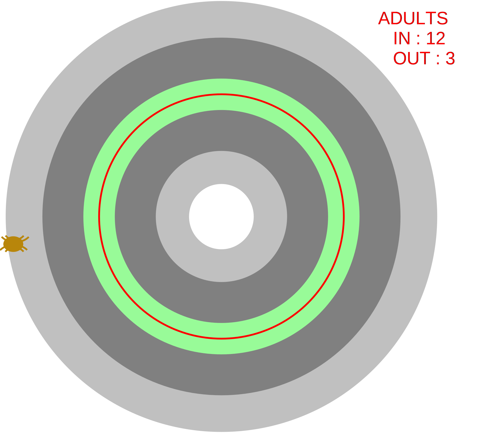
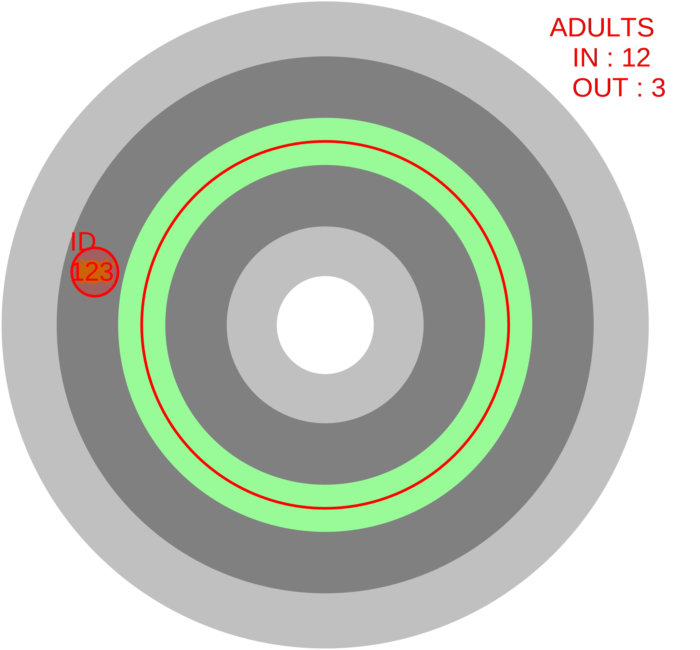
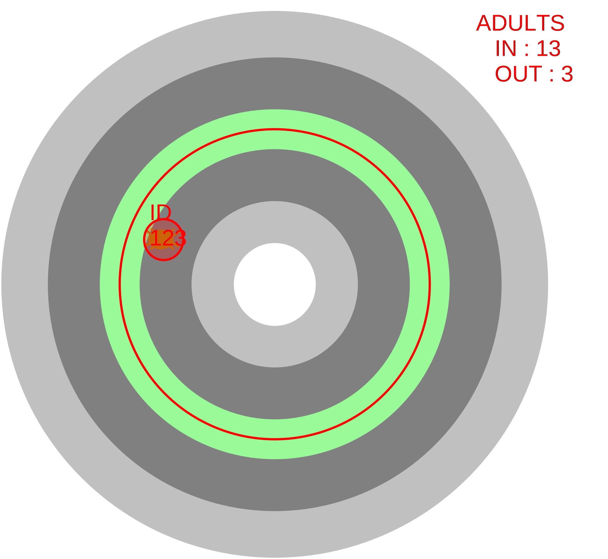
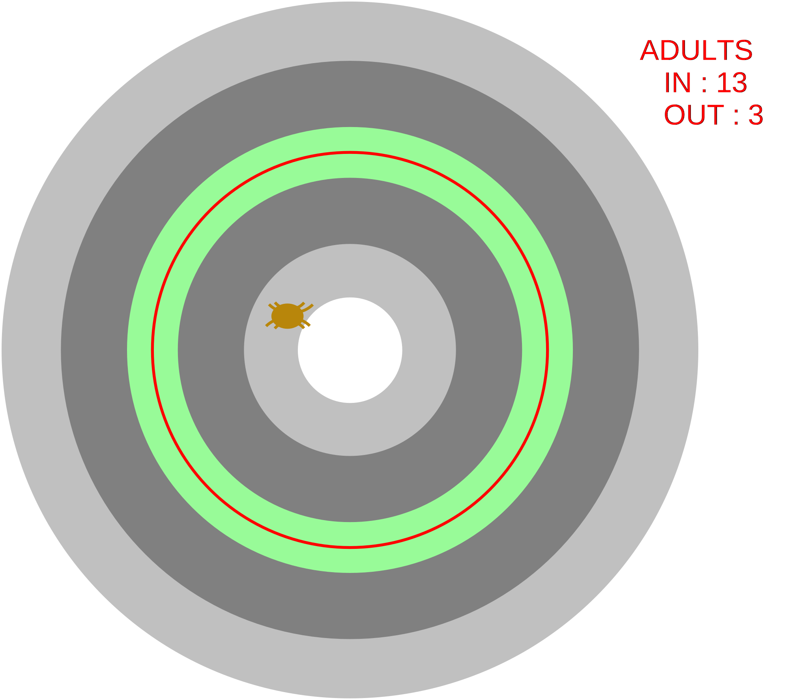
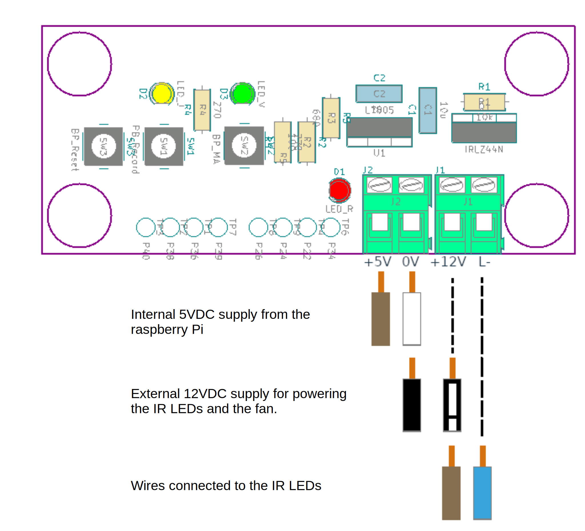
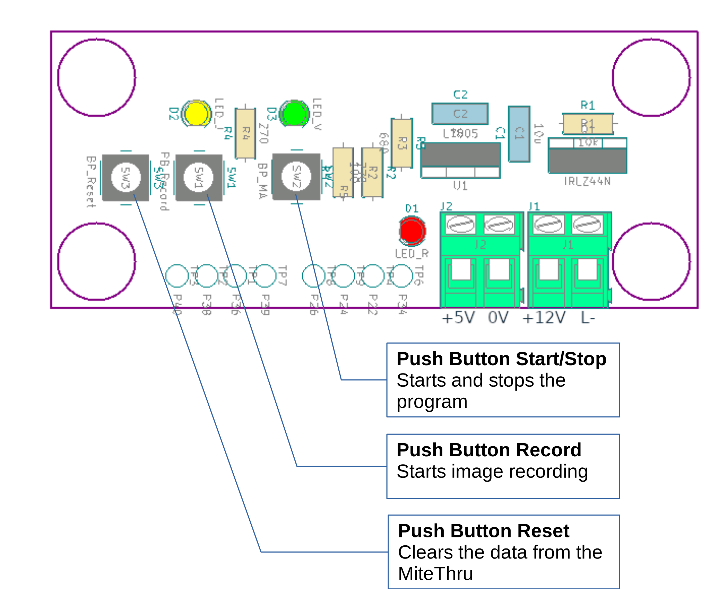
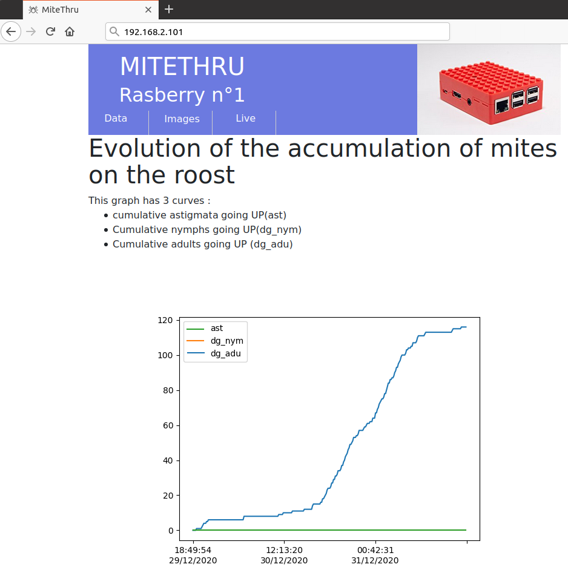
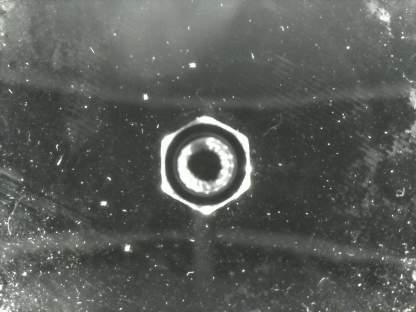

# MiteThru
MiteThru is a raspberry based system used to count red mites going to/from a hen. 

It can count one mite,

<iframe width="560" height="315" src="https://www.youtube.com/embed/HM9iWV7Sr2Q" title="YouTube video player" frameborder="0" allow="accelerometer; autoplay; clipboard-write; encrypted-media; gyroscope; picture-in-picture" allowfullscreen></iframe>

Or, many mites at the same time 

<iframe width="560" height="315" src="https://www.youtube.com/embed/uRkvY6X4qfg" title="YouTube video player" frameborder="0" allow="accelerometer; autoplay; clipboard-write; encrypted-media; gyroscope; picture-in-picture" allowfullscreen></iframe>

This MiteThru system uses :

- a raspberry pi 3 model B programmed using [python3](https://docs.python.org/3/) language,
- a native pi camera V2 Night Vision NoIR with a resolution of 8 mega-pixel,
- infrared Leds used to illuminate the mites,
- an electronic board with some push buttons, colored led and power devices to control the system,
- some Lego parts for a quick assembly.

The complete list of required components is available in the [Bill Of Materials](Bill_Of_Material.ods)

# How the miteThru works:

A miteThru is a device that counts mites ascending and descending from a perch, where a hen is staying. It is able to classify them according to their size. The miteThru uses an infrared camera, to visualize the mites.

A circular boundary is placed around the roost. Mites passing inside this circle are considered "IN", mites outside are considered "OUT". To avoid indecision due to mites standing on the line, or moving around it, a counting or hysteresis zone is defined. The mite that is "OUT" has to cross the inner disc of the counting zone to go to "IN". The mite that is "IN" must cross the outer disc of the counting zone to go to "OUT".

## Counting principle

The miteThru places on the registered view :

- A monitoring area (in light gray) 
- A referencing zone (in dark gray)
- A counting area (in green)
- A border  (in red)

**Step 1** : If a mite enters the tracking area, it is "seen" by the software, but has no visible identifier.

**Step 2**  : If the mite fits into the referencing area, it is assigned an ID and its area is materialized by a colored disk that is superimposed on the image. The color of the disk indicates how the mite is classified according to its size.

The size of the mite is updated with each image taken by the miteThru.

**Step 3** : If the mite enters the counting area from the outside and leaves from the inside, the "IN" counter associated with its mite category is incremented.
If the mite enters the counting area from the inside and leaves from the outside, the "OUT" counter associated with its mite category is incremented.

**Step 4** : If the mite leaves the referencing area, it loses its identifier.

The identifiers are incremented as the mites enter the referencing area. 
The identifier can range from 0 to 99999. If a 100000th mite is tracked, its identifier returns to zero.

# Commissioning

## Connecting the miteThru

The MiteThru uses a board equipped with LEDs and Push Buttons to start, stop and reset acquisitions locally. The board also power the IR LEDs illuminating the mites. All the schematics and Typon of the board can be found in the "[electronic board](https://github.com/LR69/MiteThru/tree/master/electronic%20board)" folder of this repository.

Connect the +5V power supply wires of the raspberry motherboard (brown and white wire), the +12V power supply of the circuit (wires coming from the AC/DC adapter), and the 2 wires of the infrared LEDs to the terminal block of the electronic board, as shown below. Make sure that the AC/DC adapter is not connected to the 230VAC wall socket during the connection operations.

## Operating the MiteThru

3 push buttons are present on the [electronic board](https://github.com/LR69/MiteThru/tree/master/electronic%20board) :

## Start Acquisition 
Press the **<a name="start_BP">Start/Stop button</a>** for at least 3 seconds 
	→ The green LED flashes rapidly (several times per second), which means that the acquisition program is running.

<u>Note</u>: if the power supply is interrupted or if the power supply is disconnected while the program was running, it will restart automatically when the power is restored.

## Record Images

Press and hold the **<a name="record_BP"> Record button</a>**	
									→ Image recording starts
									→ Yellow LED lights up

Release of the **<a name="record_BP2"> Record button</a>**					
									→ Yellow LED goes out
									→ Image recording stops

## Stop Acquisition 

Press briefly the **<a name="start_BP2">Start/Stop button</a>** 
	→ The green LED goes out, which means that the acquisition program has stopped.

<u>Note</u>: After the program has been stopped, it can be restarted using the Start/Stop button, without losing the previous data. The new data are then added after the others.

## Reset Acquisition 

The miteThru must be turned off (green LED off) in order to begin the erasure procedure.

Press and hold the **<a name="reset_BP">Reset button</a>** 
	→ The green LED lights up blinks quickly.
	After about 5 seconds, the green LED lights up steadly 
	Release the **<a name="reset_BP">Reset button</a>** within 2 seconds
		→  The green LED lights up continuously for 2 seconds, then goes out. 

The miteThru is then cleared.

<u>Note</u>: After a RESET, the html pages of the miteThru do not automatically update, you must restart the acquisition program so that the "Data" and "Live" tabs update. In the same way, the "Images" tab will only be updated if new images are acquired.

# Monitoring and Data Recovery

The MiteThru embeds an Apache 2 server which provides a Web Interface, written in `html` and `php`. To access the interface, connect the MiteThru using Wifi or with an Ethernet cable. Then open a Browser and type the IP address of the MiteThru :

## Tab "Data"

The web interface shows the temporal evolution of the Mites counted since the beginning of the acquisition. 3 diagrams can be seen :

- One showing the cumulative Mites going on the perch.
- An other showing  the cumulative Mites going down from the perch.
- A last one showing the instantaneous rate of climb or descent 

At the bottom of the tab, data of the experiment can be downloaded at `.csv` format by clicking on 

## Tab "images"

When the Push  [Record button](#record_BP)	 has been used to store images, this tab is used to check and download the images. Images are displayed as a link to the raw and processed images (at the bottom of the page). All the images of a record are available at download as a `.zip` file containing images at `.jpg` format. 

- Download the zip of the images by clicking on the links, then unzip the images and check that they are viewable. 
- If needed, jpeg images can be added (using [ffmpeg](https://www.ffmpeg.org/) for instance), to form a video like these presented at the top of this Readme. 

This tab can also be used to trigger automatically video acquisitions, on a certain level of mites being tracked at the same time, or on a periodic basis.

## Tab "Live"

On this page, two images are continuously updated by the program. 

1. The first image is the raw image take by the camera,
    
2. On the second image, elements related to image processing have been added.
   

